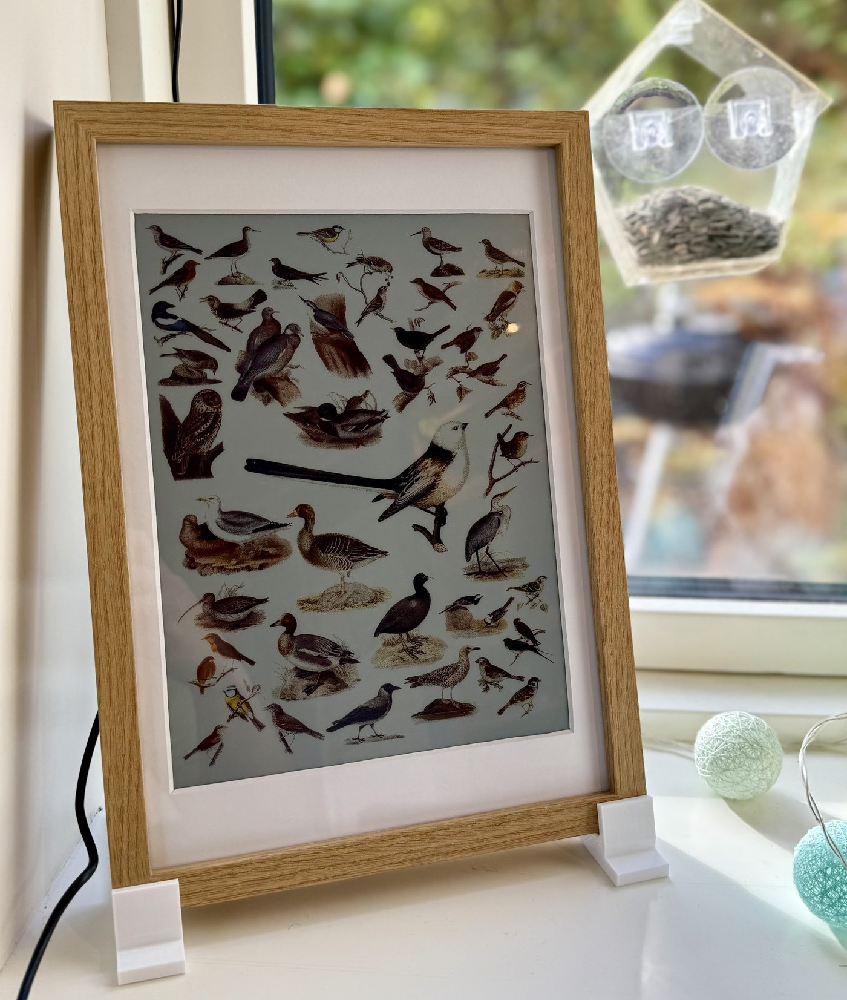
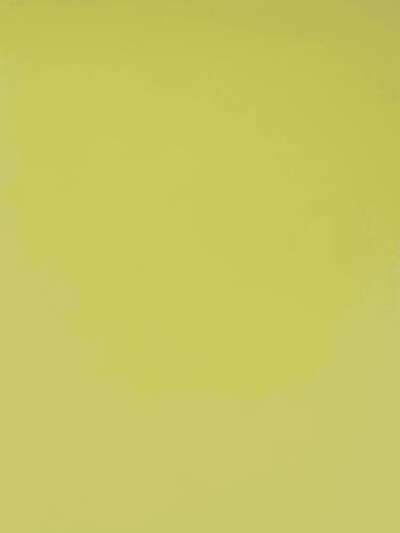
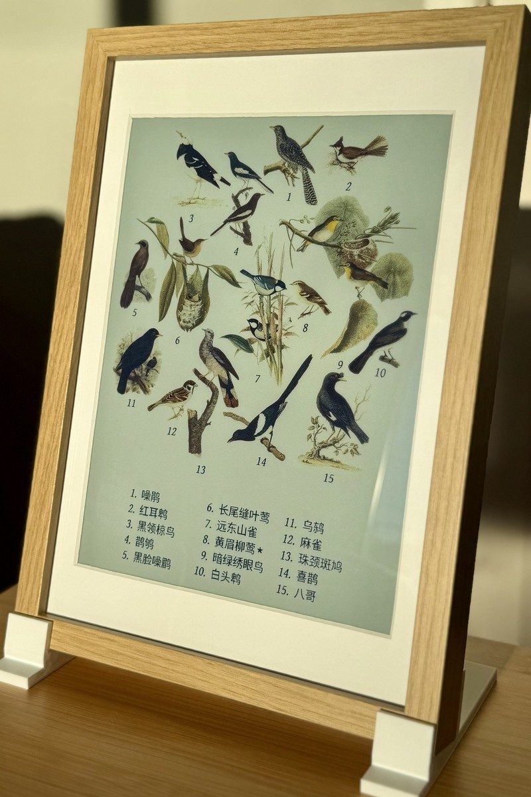
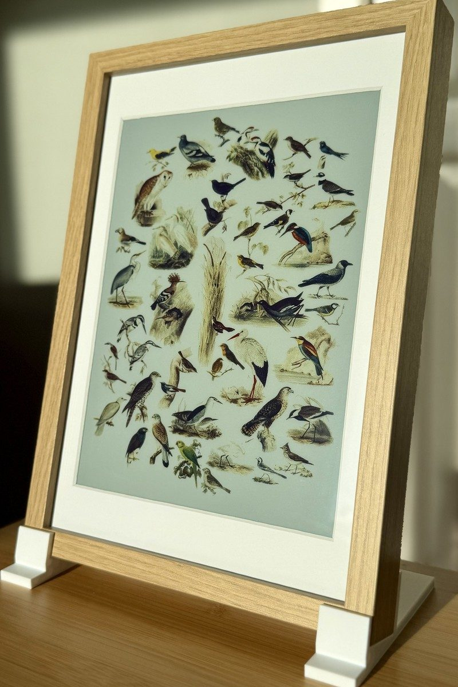
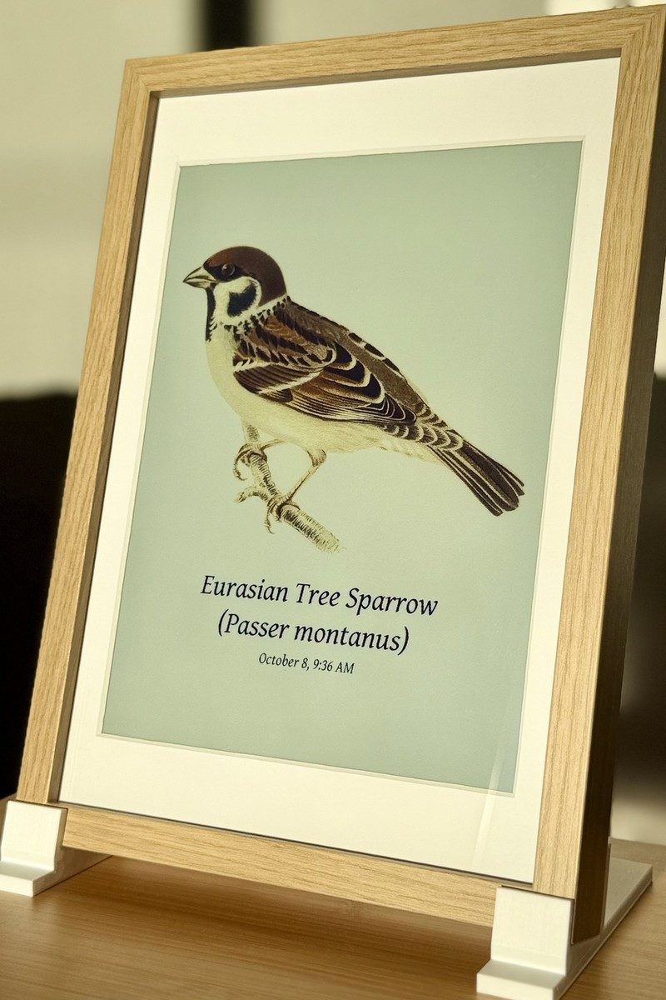

# fugleramme
Bird frame for Raspberry Pi or your homelab - real-time bird detection by audio, fully local AI, rendered as real, hand-cut 1800s bird illustrations. On an e-ink panel, a TV, or any screen.

<p align="center">
  
</p>

<p align="center">
  <a href="https://fugleramme.arnegiacomo.dev"></a>
  <a href="https://github.com/arnegiacomo/fugleramme/releases"></a>
  <a href="#license"></a>
  <a href="https://github.com/sponsors/arnegiacomo"></a>
  <br>
  <a href="https://github.com/arnegiacomo/fugleramme/stargazers"></a>
  <a href="https://github.com/arnegiacomo/fugleramme/graphs/contributors"></a>
  <a href="#art"></a>
  <a href="#art"></a>
</p>

> [!IMPORTANT]
> Fugleramme has been selected for the [GOSIM Spotlight](https://spotlight.gosim.org/shenzhen2026/) at [GOSIM Shenzhen 2026](https://shenzhen2026.gosim.org/). If you're there, come by and say hi!

Live demo: **[fugleramme.arnegiacomo.dev](https://fugleramme.arnegiacomo.dev)** shows the birds heard in my garden in Bergen, Norway, right now. More frames around the world in the [Showcase](https://arnegiacomo.dev/fugleramme/showcase/). Full docs: **[arnegiacomo.dev/fugleramme](https://arnegiacomo.dev/fugleramme/)**

## Inspiration

A [WWF Verdens naturfond poster by Axel Thorenfeldt](https://www.axelthorenfeldt.com/news/wwf-verdens-naturfonds-fugleskole)
hangs on my wall, and I wanted a version of it showing the actual birds in my garden. Teddy Warner's
[AvianVisitors](https://theodore.net/projects/AvianVisitors/) gave me the idea of the live e-ink frame.

## How it works

[BirdNET-Go](https://github.com/tphakala/birdnet-go) listens on a mic and identifies the
birds. Fugleramme polls its API, matches each species to an illustration, packs them onto a
page, and redraws only when the birds change - on an
[Inky Impression](https://shop.pimoroni.com/discount/ARNE?redirect=/products/inky-impression)
e-ink panel or any screen. An admin page lets you configure what to show, and the frame
updates itself.

<p align="center">
  
  <br>
  <em>Full e-ink redraw (2x speed).</em>
</p>

Already run BirdNET-Go? Point the frame at it, on the same machine or anywhere on your network.

> [!TIP]
> The e-ink panel on a Pi is what makes it a picture frame, but neither is required. Fugleramme also runs in a
> container on basically anything - a homelab, a NAS, an old laptop - and the page takes the shape of whatever
> shows it: a TV, an HDMI display, an external e-ink panel, any browser, or your desktop wallpaper. Everything
> runs on your own hardware and works fully offline. See [Container](docs/container.md) and
> [Screens](docs/screens.md).

## Hardware

A Raspberry Pi 5, an [Inky Impression](https://shop.pimoroni.com/discount/ARNE?redirect=/products/inky-impression)
13.3" or 7.3" (Spectra 6), a mic and an IKEA frame. Parts list and supported alternatives in **[Hardware](docs/hardware.md)**,
putting it together in **[Mounting](docs/mounting.md)**.

I'm affiliated with Pimoroni - buying through the Pimoroni links or using the code `ARNE` at checkout supports this project.

## Art

Half the point of this project is showing off some amazing public-domain natural-history
illustrations. Nearly 1200 cut-outs covering over 650 species, every one taken from a
real plate and hand-curated for this project (no art is AI-generated, though some has been
retouched with AI).

Each bird is sized by real body mass, the larger ones toward the centre, on a textured paper page.

Coverage is best across Europe and northern Asia, good in North America, and growing elsewhere. Pick your
location in [Species coverage](https://arnegiacomo.dev/fugleramme/species/) to see which of your local birds are
covered, or [cut one yourself](docs/adding-artwork.md).

Species names in 40+ languages, see [Languages](docs/languages.md).

<p align="center">
  
  
  
</p>

| No detections | A few visitors | A full garden |
| :---: | :---: | :---: |
|  |  |  |

## Install on a Raspberry Pi

On the Pi:

```bash
curl -fsSL https://raw.githubusercontent.com/arnegiacomo/fugleramme/main/install.sh | bash
```

It asks where BirdNET-Go should run and which ports to use, then installs everything and starts the frame as a
service. A fresh system usually needs a reboot. Starting from a blank SD card? See the [install guide](docs/install.md).

## Run in a container

```bash
docker run -d -p 8080:8080 -v fugleramme:/data \
  -e FUGLERAMME_DETECTOR_URL=http://birdnet.local:8080 \
  ghcr.io/arnegiacomo/fugleramme
```

Kiosk on `:8080`, admin on `:8080/admin`, everything it persists in `/data`.

On a Linux box with a USB mic, this brings up BirdNET-Go alongside it:

```bash
curl -fsSL https://raw.githubusercontent.com/arnegiacomo/fugleramme/main/examples/docker-compose.yml -o docker-compose.yml
docker compose up -d
```

See **[Container](docs/container.md)** for more info.

## Run locally (for development)

```bash
uv sync                                       # set up venv
uv run fugleramme-fake-detector               # stand-in BirdNET-Go on :8090
uv run fugleramme-dev                         # start service on :8080 with hot-reload
```

The fake detector's flags, and working against a real station instead:
[Running it without a Pi](CONTRIBUTING.md#running-it-without-a-pi).

## Contributing

Contributions are very welcome - fixes, docs and artwork most of all. Thanks to
[everyone who has contributed](https://github.com/arnegiacomo/fugleramme/graphs/contributors)
and [sponsored](https://github.com/sponsors/arnegiacomo) so far ❤️

<a href="https://github.com/arnegiacomo/fugleramme/graphs/contributors">
  
</a>

Want to help?

- **Something is broken** - a [bug report](https://github.com/arnegiacomo/fugleramme/issues/new/choose)
- **A question, an idea, or a frame you have built** - the
  [FAQ](https://arnegiacomo.dev/fugleramme/faq/) first, then
  [Discussions](https://github.com/arnegiacomo/fugleramme/discussions)
- **A fix, a doc change, or a bird you have cut** - open a PR, no issue needed
- **Don't know where to start** - the [good first issues](https://github.com/arnegiacomo/fugleramme/labels/good%20first%20issue)

See **[Contributing](CONTRIBUTING.md)** for more info. For anything else, you can reach me through
[arnegiacomo.dev](https://arnegiacomo.dev/).

## Similar projects

- [AvianVisitors](https://github.com/Twarner491/AvianVisitors) - BirdNET-Pi, AI-generated illustrations and photo cutouts, also sold as [kits](https://theodore.net/store/)
- [inky-bird-frame](https://github.com/veteranbv/inky-bird-frame) - BirdNET, field-journal illustrations on an Inky panel
- [HABirdDashboard](https://github.com/adamoberley/HABirdDashboard) - BirdNET-Go, a collage card for Home Assistant
- [belkins-birdnet](https://github.com/Belkins/belkins-birdnet) - BirdNET-Pi, AI-generated kachō-e style illustrations
- [featherframe](https://github.com/wr/featherframe) - BirdNET-Pi, Audubon plates on an ESP32 e-ink panel
- [birdframe](https://github.com/simenf/birdframe) - BirdNET-Go, several art styles on a Samsung Frame TV
- [Plate197](https://github.com/kevinl95/Plate197) - BirdNET, Audubon plates on a Raspberry Pi touchscreen

Fugleramme shares no code or art with them.

## Built on fugleramme

- [fugleramme-samsung-frame](https://github.com/conradj/fugleramme-samsung-frame) - sends the collage to a Samsung Frame TV in Art Mode
- [birdnet-frame](https://github.com/icecoldfire/birdnet-frame) - a Docker container that sends the collage to a Samsung Frame TV in Art Mode
- [birdnet_eink](https://github.com/Sidiox/birdnet_eink) - the artwork on a LilyGO T5 4.7" ESP32 e-ink display
- [birdframe](https://github.com/ben-gy/birdframe) - the collage in greyscale on a QuirkLogic Papyr 13.3" e-ink tablet
- [Cobalt Birds](https://github.com/BandarLabs/Cobalt/tree/main/apps/birds) - the collage on a Kobo e-reader running Cobalt

## License

- Code: MIT - see [`LICENSE`](LICENSE).
- Detection ([BirdNET-Go](https://github.com/tphakala/birdnet-go), installed
  separately as a container): CC BY-NC-SA 4.0, non-commercial only. BirdNET model
  by the Cornell Lab of Ornithology and Chemnitz University of Technology,
  taxonomy data powered by eBird.org.
- Bird images: each style folder carries its own terms and sources, and its
  manifest links the plate every file was cut from. `classic` is
  CC BY-SA 4.0 - see
  [`assets/artwork/classic/ATTRIBUTION.md`](assets/artwork/classic/ATTRIBUTION.md).
- Label fonts (`assets/fonts/`): SIL OFL 1.1 - see
  [`assets/fonts/ATTRIBUTION.md`](assets/fonts/ATTRIBUTION.md).
- Bird sizes (`assets/bird_sizes.csv`): body mass from AVONET (Tobias et al.
  2022, Ecology Letters, [doi:10.1111/ele.13898](https://doi.org/10.1111/ele.13898)),
  CC BY 4.0.
- BirdNET scientific-name aliases (`assets/birdnet_aliases.json`):
  [OpenFauna](https://github.com/tphakala/openfauna)'s compiled taxonomic alias
  map, CC BY-SA 4.0 - see [`assets/ATTRIBUTION.md`](assets/ATTRIBUTION.md).
- Docs search (`docs/assets/fuse.min.js`): [Fuse.js](https://www.fusejs.io/) by
  Kiro Risk, Apache 2.0.
