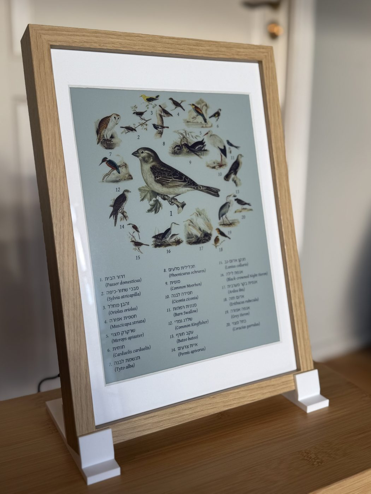

# Languages

The species names on the rendered page come from BirdNET-Go, in any of its species languages.

> [!NOTE]
> The admin page is currently only offered in English.

| Hebrew | Chinese |
| :---: | :---: |
|  |  |

## Species languages

At the time of writing, these are the species languages:

| Picked | Languages |
| --- | --- |
| By name, as primary or second | Czech, Danish, Dutch, English, Finnish, French, German, Hungarian, Italian, Latvian, Norwegian, Polish, Portuguese, Slovak, Spanish, Swedish, and the scientific name |
| Through **BirdNET-Go locale** | Afrikaans, Arabic, Bulgarian, Catalan, Chinese, Croatian, Estonian, Greek, Hebrew, Hindi, Icelandic, Indonesian, Japanese, Korean, Lithuanian, Malayalam, Romanian, Russian, Serbian, Slovenian, Thai, Turkish, Ukrainian, Vietnamese, and regional variants of English and Portuguese |

Select them under [Labels](display.md#labels) in the admin page's Display tab.

The first row has one dictionary per language in BirdNET-Go. Only downloaded
dictionaries are offered.

**BirdNET-Go locale**, shown in the language list as e.g. "Estonian (BirdNET-Go
locale)", uses whatever BirdNET-Go's Settings -> Analysis -> Species Language is
set to. That can be any of
[BirdNET-Go's species languages](https://github.com/tphakala/birdnet-go/wiki/BirdNET-Go-Guide#supported-languages-for-species-labels).

Dates on the page follow the primary language.

## Scripts and typefaces

Chinese, Japanese, Korean, Thai, Arabic, Hebrew and Malayalam names are set in a Noto typeface.

A name the frame can't draw shows as its scientific name.

> [!NOTE]
> Arabic, Hebrew and Malayalam names need `libfribidi0`. A frame installed before
> v0.28.0 doesn't have it: run `sudo apt install libfribidi0` and reboot (Until
> then those names show as scientific names). Docker unaffected.
