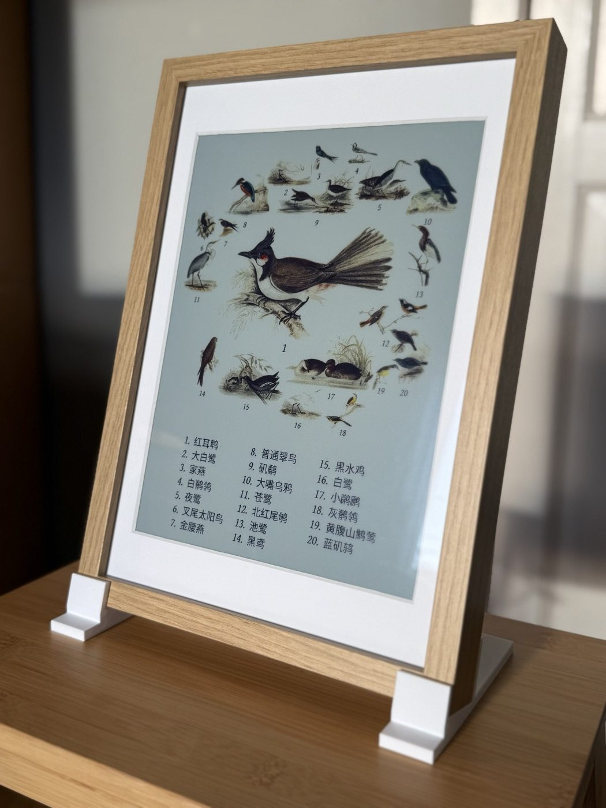
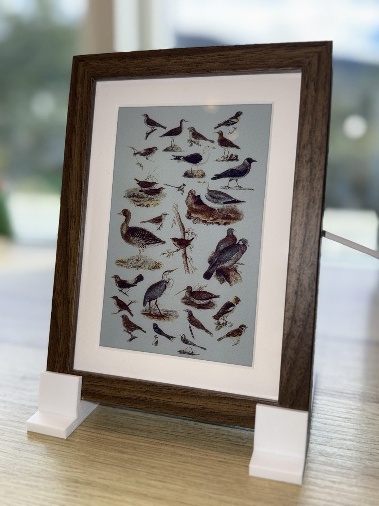
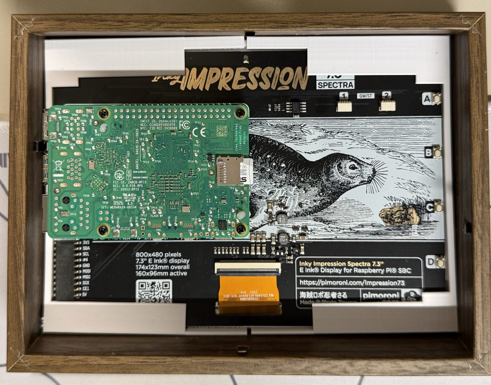
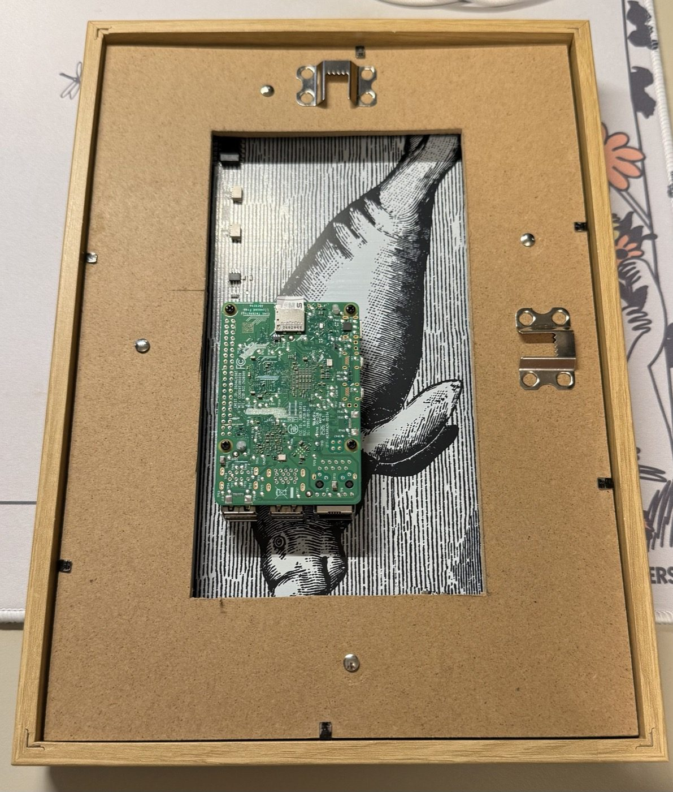
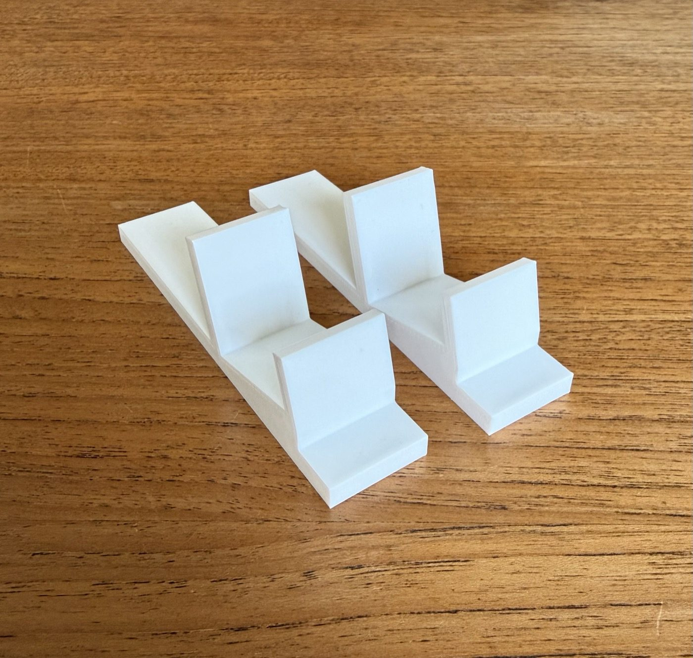

# Mounting

Both recommended panel sizes will fit an IKEA RÖDALM picture frame: the 13.3" in the 21x30 (A4), and
the 7.3" in the 13x18.

| 13.3" in a RÖDALM 21x30 | 7.3" in a RÖDALM 13x18 |
| :---: | :---: |
|  |  |

> [!TIP]
> This frame is cheap, so it lets you mess up a few times without it costing
> your right kidney.

## 13.3" in a RÖDALM 21x30

The 13.3" panel board is exactly A4 - 297 x 210 mm - so it fits any A4 picture frame.

I recommend the IKEA
[RÖDALM 21x30](https://www.ikea.com/gb/en/p/roedalm-frame-oak-effect-50566393/).
It sits pretty snug, and at 3 cm it is just deep enough for the Pi to sit
inside without touching the wall.

Front to back:

```
front
  |
  +-- front sheet (optional - adds glare, flattens the passepartout)
  +-- passepartout, cut down to fit
  +-- e-ink panel, with the Pi mounted to it on the included screws
  +-- the frame's own plastic spacer, tightened against the metal fasteners
  +-- open cavity (let the Pi breathe)
  +-- backing board with a hole cut for the Pi (optional)
  |
back
```

### Passepartout

The included mat is cut for a much smaller picture. Get e.g. a **24 x 30 cm
passepartout for 18 x 24 cm pictures** instead, and cut **1.5 cm off each long
side** with a sharp craft knife and a steel ruler, so it comes down to 21 x 30 cm
and fits the frame.

> [!TIP]
> Cut against the steel ruler in several light passes rather than one hard one -
> and buy a spare mat or two or three (recommended from experience).

## 7.3" in a RÖDALM 13x18

The [Inky Impression 7.3"](https://shop.pimoroni.com/discount/ARNE?redirect=/products/inky-impression)
fits an IKEA [RÖDALM 13x18](https://www.ikea.com/gb/en/p/roedalm-frame-oak-effect-10566390/)
with a printed
[insert](https://github.com/arnegiacomo/fugleramme/blob/main/examples/3d/inky-impression-7.3-rodalm-insert.stl)
that holds the panel centred in the frame. Print it lip down, flat on the bed.

No 3D printer? Cardboard also works: cut pieces to fill the gap around the panel and pin them down under the frame's own plastic spacer.

The frame's included passepartout fits the 7.3" panel as it is.

> [!WARNING]
> The 13x18 frame doesn't leave enough room for the mic's USB cable. Cut a hole or a
> notch in the frame, so it fits.



## Airflow

Leave the backing board out, or cut a big hole in it.



> [!WARNING]
> The Pi and the active cooler sit in the cavity behind the panel, and the
> constant BirdNET inference gets them quite hot. Don't close the back up.

## Stand upright

Print a pair of
[stand feet](https://github.com/arnegiacomo/fugleramme/blob/main/examples/3d/rodalm-stand-feet.stl)
and stand it on its own. Each foot grips the bottom edge of the frame at an angle of 15°. They fit
both RÖDALM sizes, in landscape or portrait.



## Hanging it

If you plan to hang it on the wall, put rubber feet or standoffs, like the ones
you get at a hardware store, on the back corners. They hold the frame off the wall so air can flow behind it.
